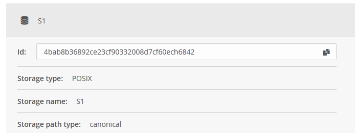

Archiving and expiring
======================

Long-term archiving is an important process in the data lifecycle. The ``fs2od`` utility understands this and implements this process using extensive support of the Onedata management system. The user can decide whether it wants to replicate the data to more providers, how many providers to use and possibly cease support from some providers.

Overview
---------
Because of this usecase we introduce a new term "**Primary provider**". The primary provider is an instance of the Oneprovider which runs on the same filesystem as ``fs2od``. Other providers (secondary providers) can but are not required to run on the same filesystem. All the data imported to the system are imported through the primary provider. Primary provider has also ability to duplicate the data from itself to other providers (other providers lack this ability). Also, the primary provider can decide to remove the data from itself if they are replicated on at least one different provider.

Archiving
----------
In order to use archiving, there is a need of at least one other running provider which can be connected to the same Onezone as the primary provider. This provider also needs a space to store duplicate data.

The archiving is achieved by creating the Onedata's Quality of Service (QoS) entry. This ensures, that all the data is replicated immediately after the import. Using the built-in feature of the Oneprovider also leaves the responsibility for the duplication on the Onedata platform, which is the first and the closest chain link in the system.

Oneprovider setup
+++++++++++++++++
The secondary provider must be firstly connected to the Onezone. The setup is completely identical to `Oneprovider Deployment <./oneprovider.html>`_ up to step `Adding the storages <./oneprovider.html#adding-the-storages>`_ (including). Only difference is that this storage **cannot** be an imported storage.

``fs2od`` setup
+++++++++++++++
The tokens must be generated for the secondary providers as well. This can be done as in `Creating tokens <./fs2od.html#creating-tokens>`_.

For the software to process the secondary provider, there is the storage id needed. It can be found in:

.. centered::
   CLUSTERS > Select secondary Oneprovider -> Storages

.. centered::
   Select storage > Copy ID

Configuration
+++++++++++++
With all the steps underwent, the last step is to edit the configuration of the software. This can be done adjusting these settings

- ``restAccess->oneproviders->[1-*]`` - Set up the host and the API token as with the primary providers
- ``restAccess->oneproviders->[1-*]->storageIds`` - List of storage IDs which can be used for data replication. If more than one storage ID is provided, the final storage when the replication request occurs is selected using hashing function. This means, that the data should be distributed between storages uniformly.

Other configuration is done only under ``dataReplication``

- ``enabled`` - If ``True``, enables the data replication (archiving). This will cause all the latter created datasets to be set-up with replication turned on and data transmission between providers.
- ``numberOfReplicas`` - Number of the secondary providers the data will be replicated on. If the number is higher than number of access info entries provided in ``restAccess->oneproviders``, the number is lowered to this number (number of secondary providers) at startup.

Expiration
----------
The data cannot expire independently. In order to remove the data from some providers, this must be explicitly specified by user. The usual usecase of data expiration is freeing the space on the primary provider (yet the only possiblity).

Requirements
++++++++++++
For allowing the data to be removed from primary provider, the ``fs2od`` metadata file must be enabled (``fs2odMetadataFile->enabled: True``). This is needed because the data deletion creates its own metadata, which can be stored only in this file.

The second requirement is for the dataset to be already replicated on at least one different secondary provider.

Configuration
+++++++++++++
With the Archiving enabled, the next settings must be adjusted

- ``timeUntilRemoved`` - the time interval between deletion request and the real data deletion. The time interval can be of two types, `internal timestamp <#internal-timestamps>`_ and keywords. The allowed keywords are ``never`` and ``now``. There is one special keyword which is used for internal purposes only - ``transfer``. Using this keyword by user can cause undefined behaviour.

.. warning::
    Be aware of the value ``now``, it will remove files immediately after deletion request is received!

- ``removeFromFilesystem`` - Boolean value telling, if the data should be physically erased from the filesystem. If ``True``, the data will be removed also from the filesystem immediately after ceasing the secondary provider support. If ``False``, the data will stay on the filesystem (they will not be imported again until some action is taken).

Workflow
++++++++
To remove the data from the primary provider, edit the metadata file (``fs2odMetadataFile``) and insert the keyword ``primary`` into the ``DeniedProviders`` list. This will cause the an informational email to be sent to specified receivers. If the ``timeUntilRemoved`` is set to ``now``, the dataset is removed immediately. If ``never``, the dataset will not be deleted, and only the informational email is sent.

This action also adds the new key to metadata file; ``RemovingTime``. This is the UTC timestamp representing the time when the dataset removal procedure will be taken. This value can be adjusted or set to already known keywords; ``now`` will remove the dataset from primary provider immediately when the next run of ``fs2od`` occurs, ``never`` will stop the deletion process.

The metadata file value ``LastProgramRun`` is adjusted with every ``fs2od`` run and allows the email to be sent as an idempotent operation (only once and only after the interval passes).

Internal timestamps
-------------------
The ``fs2od`` utility introduces new internal timestamps. These timestamps can define the time interval with resolution up to one hour.

The allowed keywords are:
 - ``h`` - hour
 - ``d`` - day = 24 hours
 - ``m`` - month = **exactly** 30 days = 30 * 24 hours
 - ``y`` - year = **exactly** 365 days = 365 * 24 hours

The number value must be connected to keyword (no space). Two following value-keywords must have at least one space between them. These keywords can be combined in one string and can be even duplicated. Exemplary allowed values: ``7d 5h``, ``10y``, ``7d 5h 3d`` (<==> ``10d 5h``), exemplary denied values: ``7d5h``, ``10``, ``7d5h3``.
