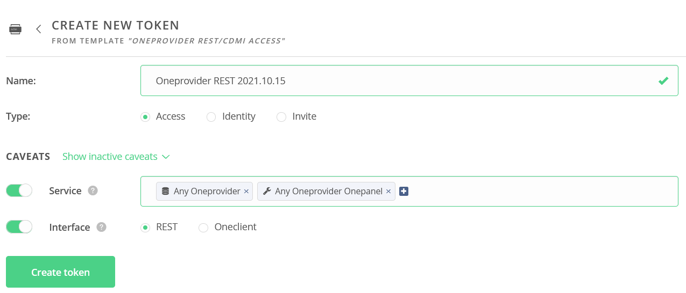
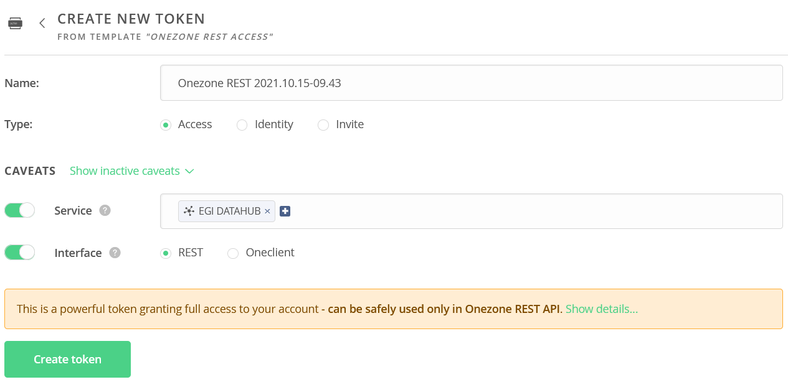
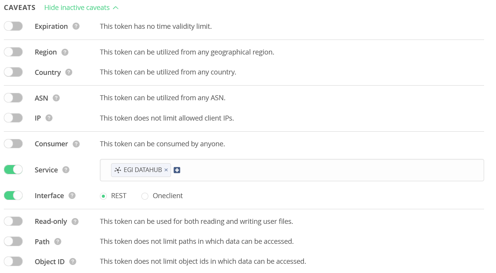

``fs2od`` utility
=============

``fs2od`` (filesystem to Onedata) software is a separate part of the system, simplifying interaction with the Onedata system. This software is packed into a Docker container by default. It can take a list of directories that should be uploaded to the cloud, check them periodically, and import them into the Onedata system. Each subdirectory of the specified directory represents a separate dataset. For each such dataset, the Onedata space will be created.

Requirements
------------
``fs2od`` should run on the same node as Oneprovider. It must have access to the directories that will be loaded to Onedata.

Downloading the software
-----------------------
Before the first run of ``fs2od``, the application behaviour must be configured. The following two files help to do it correctly:

- docker-compose.yaml – Docker compose file containing a recipe to download and run a container consisting of ``fs2od`` application. Download at https://raw.githubusercontent.com/CERIT-SC/fs2od/master/docker-compose.yaml
- config.yaml – Application configuration file. Download at https://raw.githubusercontent.com/CERIT-SC/fs2od/master/app/config.yaml

The software is ready to run with only the two files mentioned above. For some advanced usage, it is also possible to download the source code of software from its git repository:

.. code:: bash

   git clone https://github.com/CERIT-SC/fs2od.git .

Creating tokens
---------------
Tokens are essential to communicate with Onezone and the Oneprovider.

Creating tokens:

.. centered::
   TOKENS > Create new token (plus sign on the top in the left menu)

You will need the following three tokens:

1.	Oneprovider REST access token
2.	Oneprovider Onepanel REST access token
3.	Onezone REST access token

Oneprovider and Oneprovider Onepanel tokens have to be generated at once. We will use such "two-in-one" token in the following text. To get the ``Oneprovider REST access token`` and the ``Onepanel REST access token``, click on the icon ``ONEPROVIDER REST/CDMI ACCESS``. Select the name for the token or keep the suggested one. Set the type to ``Access``.  Insert the two options into the Service field as shown in the picture. There are two possibilities for the selection: either a specific Oneprovider instance or a token common for all of the Oneproviders. The interface should stay REST.

.. note::

    Sometimes, the REST option will block the ability to communicate with Onezone/provider/panel. When this happens, generate the above tokens with the Interface switch switched off.

To get the ``Onezone REST access token`` click on the ``ONEZONE REST ACCESS`` icon. Select the name of the token or keep the suggested one. Set the type to ``Access``. Select the specific Onezone as the Service (EGI DATAHUB). The interface should stay REST.

All the tokens can also have many other caveats – restrictions on token usage.

.. note::

    For security reasons, it is recommended in production to restrict the usage of tokens to specific IP addresses using an IP access list. This makes the token usable only from a given set of IP addresses. If the usage is limited to only some IP addresses, the machine where ``fs2od`` runs must be included in the IP whitelist as well.

Application configuration
-------------------------
The ``fs2od`` application can be tuned to maximum user satisfaction using the configuration file ``config.yaml``. Attributes in the config file are accompanied by self-standing documentation.

Additional documentation, however, can help in some situations. There are some of the keys:

- ``watchedDirectories`` - List of directories which should be monitored. The values should be the same as the mapping values in `docker-compose.yaml`. This key allows to use regex as in UNIX-like operating system. More examples in exemplary `config.yaml`.
- ``metadataFiles`` - List of file names which should be checked when intending to check for the new dataset (definition metadata file). If any of these filenames is found, the new dataset will be created. This is also the filename where dataset access info will be stored unless ``fs2odMetadataFile->storeAccessInfo`` is set to ``True``
- ``fs2odMetadataFile`` - if ``enabled`` is ``True``, the email support, removing provides and more features will be enabled, and the internal metadata will be stored in. If this is a thing and ``storeAccessInfo`` is set to ``True``, access info formerly stored into ``metadataFiles`` will be stored to file given by ``filename``
- ``importMetadata`` - if set to ``True`` all metadata found in the metadata file (found as using one of the ``metadataFiles`` entry) will be JSONized and stored into Onedata built-in metadata storage for each dataset (dataset fileId). This metadata will be updated also when metadata file updated. This does not store ``fs2od`` access info
- ``restAccess`` - contains information about connections and authentication against Onezone/provider/panel. Filling out ``onezone`` and at least one item in ``oneproviders`` is mandatory. Exactly one item in ``oneproviders`` must have key ``isPrimary`` set to ``True`` (primary Oneprovider), others (which have ``isPrimary: False``) must have at least one storage id provided in ``storageIds``. This column is ignored in primary Oneprovider.
- ``messaging`` - more info in `Messaging <./messaging.html>`_
- ``dataReplication`` - more info in `Archiving and expiring <./archiving_expiring.html>`_

- REST API hostnames and tokens to Onedata services:

    Hostname of EGI DATAHUB Onezone is ``https://datahub.egi.eu``. Paste tokens acquired in the previous step to the configuration file. Oneprovider and Oneprovider Onepanel hostnames are in our installation (one-node Oneprovider cluster) same.

Finding out hostname of the Oneprovider:

.. centered::
   CLUSTERS > Select your cluster > Overview > Section INFO > Domain (copy to clipboard)

Running the application
-----------------------
Running the application using docker compose command `(implicit run)`:

.. code:: bash

   docker compose up -d

Running the application manually, e.g. for the testing purposes `(explicit run)`:

Start checking (scanning) the directories using:

.. code:: bash

   docker compose exec fs2od python -m fs2od scan

However, ``fs2od`` has a lot of different features. These can be found in the documentation, or explored using:

.. code:: bash

   docker compose exec fs2od python -m fs2od --help

Moving to production
--------------------
After testing the application, the whole environment should be switched to production. This can be done following the next steps:

- in ``config.yaml`` set the variable ``testMode`` to ``False``,
- in ``docker-compose.yaml`` set the variable ``RUN_PERIODICALLY`` to ``"true"``
