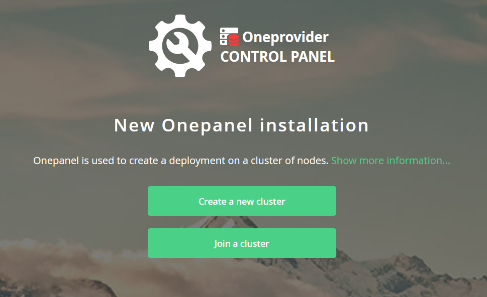
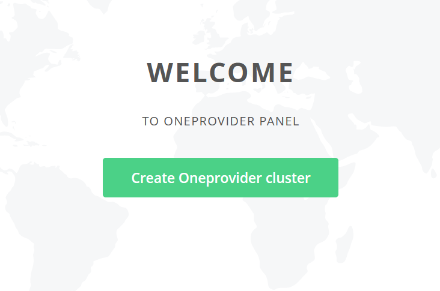
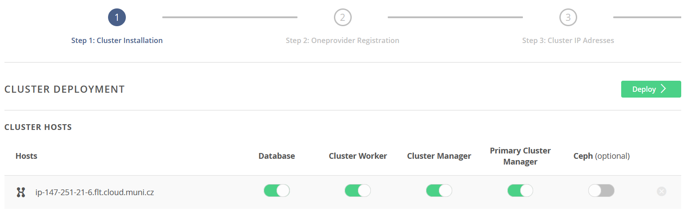
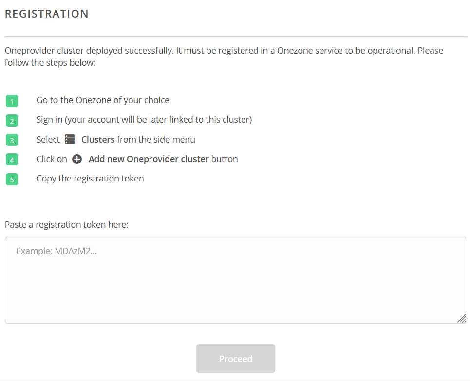
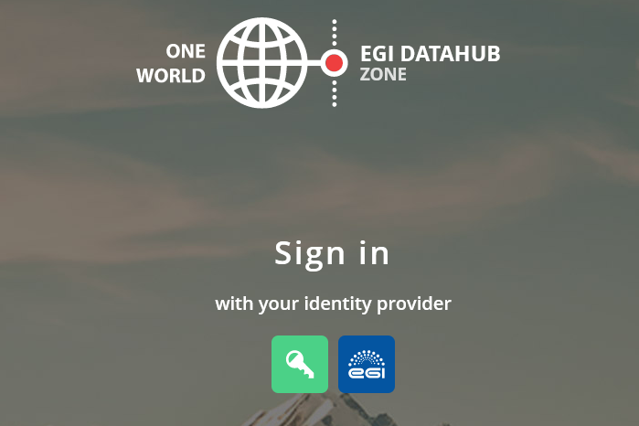
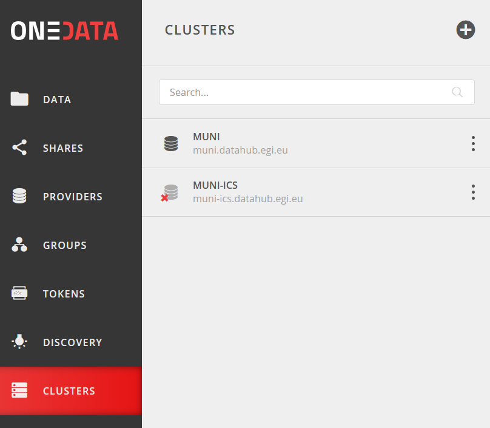
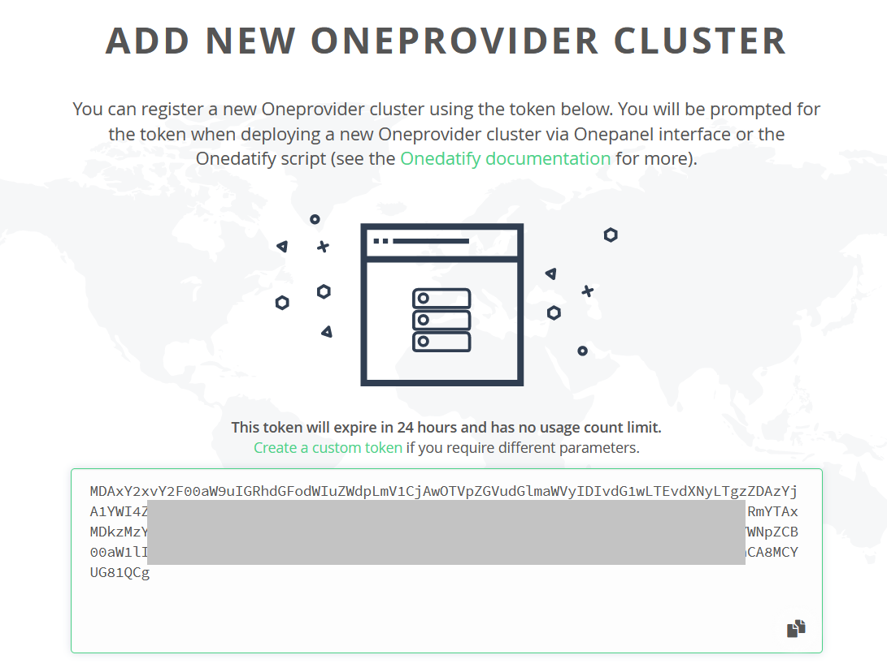
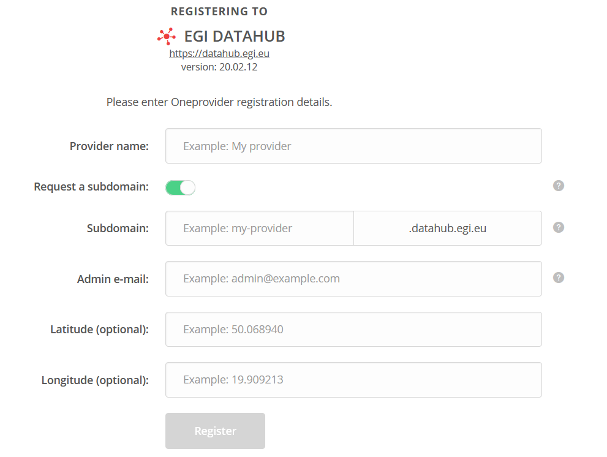
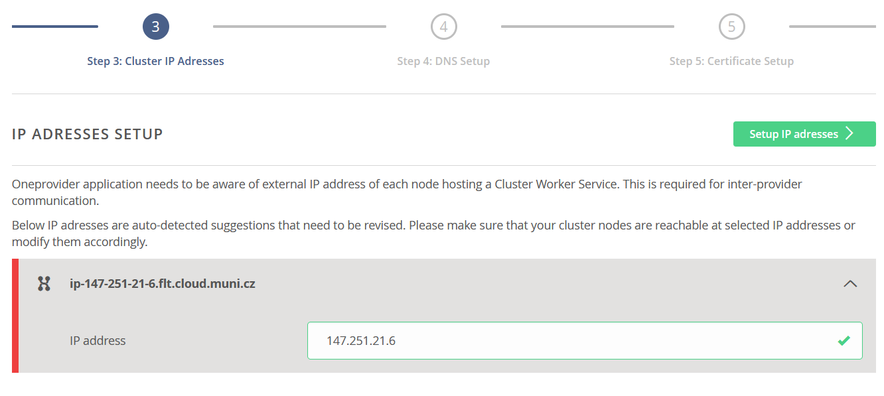
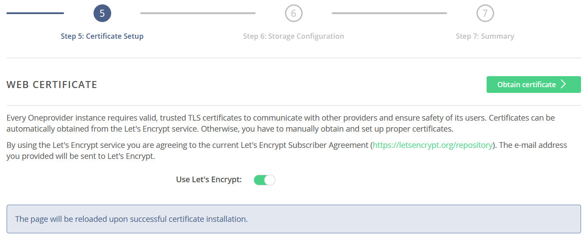

Deployment of Oneprovider
=========================
There are several possibilities how to install and deploy Oneprovider service. All options you can find in documentation of Onedata (https://onedata.org/#/home/documentation). In this tutorial we describe deployment of Onedata service using Docker.

Requirements
------------
Requirements to run Oneprovider are described in official documentation as shown in the table. We recommend use Optimal setting. In following text there is described One provider deployment for usage of up to 100 users, for more sophisticated deployment please see Onedata documentation (https://onedata.org/#/home/documentation/stable/doc/administering_onedata/oneprovider_tutorial.html). 

.. csv-table:: Requirements of Oneprovider
   :file: ../tables/oneprovider_requirements.csv
   :header-rows: 1
   :stub-columns: 1

(https://onedata.org/#/home/documentation/stable/doc/system_requirements.html)

Prepare environment for containers running
------------------------------------------
At first is needed to install Docker subsystem. Installation steps depends on your operating system. Installation instruction you can find at official documentation (https://docs.docker.com/get-docker). After installation may be needed to add your user to group which has access to Docker. 

.. code:: bash

   # create group docker (might not be necessary)
   sudo groupadd docker
   # add user defined in variable $USER to group docker
   sudo usermod -aG docker $USER

Next you need to get tool Docker compose. Steps for your architecture are described at https://docs.docker.com/compose/install

Prepare environment for Oneprovider
-----------------------------------
Following script-like text was created from Onedata documentation. Go through the script command by command and execute commands that you see are appropriate for your case. 

.. code:: bash

   ## Increase maximum number of opened files
   # In order to install Oneprovider service on one of the supported operating systems, first make sure that the maximum limit of opened files is sufficient (preferably 63536, but below /proc/sys/fs/file-max). The limit can be checked using:
   ulimit -n

   # If necessary, increase the limit using:
   sudo sh -c 'echo "* soft nofile 63536" >> /etc/security/limits.conf'
   sudo sh -c 'echo "* hard nofile 63536" >> /etc/security/limits.conf'

   # It might be also necessary to setup the limit in /etc/systemd/system.conf:
   sudo sh -c 'echo DefaultLimitNOFILE=65536 >> /etc/systemd/system.conf'
   sudo systemctl daemon-reexec

   ## Swap preference settings
   # Make sure that the swap preference (i.e. swappiness) is set to 0 (or at most 1 - see here for details):
   cat /proc/sys/vm/swappiness

   # and if necessary decrease it using:
   sudo sh -c 'echo "vm.swappiness=0" >> /etc/sysctl.d/50-swappiness.conf'

   ## Disable Transparent Huge Pages feature
   # By default, many Linux machines have the Transparent Huge Pages feature enabled, which somehwat improves performance of machines running multiple application at once (e.g. desktop operation systems), however it deteriorates the performance of most database-heavy applications, such as Oneprovider.
   # These settings can be checked using the following commands (the output shown below presents the expected settings):
   cat /sys/kernel/mm/transparent_hugepage/enabled
   always madvise [never]
   cat /sys/kernel/mm/transparent_hugepage/defrag
   always madvise [never]

   # If any of the settings is different than the above, they should be changed permanently, which can be achieved for instance by creating a simple systemd 
   # unit file /etc/systemd/system/disable-thp.service:
   [Unit]
   Description=Disable Transparent Huge Pages
   [Service]
   Type=oneshot
   ExecStart=/bin/sh -c "/bin/echo 'never' | /usr/bin/tee /sys/kernel/mm/transparent_hugepage/enabled"
   ExecStart=/bin/sh -c "/bin/echo 'never' | /usr/bin/tee /sys/kernel/mm/transparent_hugepage/defrag"
   [Install]
   WantedBy=multi-user.target
   # and enabling it on system startup using:
   sudo systemctl enable disable-thp.service
   sudo systemctl start disable-thp.service
   # Reboot system after this configuration. 
   sudo reboot

Installation of Oneprovider
-----------------------------------
Prepare following directory structure where Oneprovider container stores its configuration and persistent data. Of course, you can choose another name for the base folder. In this example is used folder ``/opt/onedata/datahub/``. This directory will contain important operational data for Oneprovider. Whole this folder must be  backed up with appropriate tools and strategies used at the site.

.. code:: bash

   # folder for configuration and persistent data of Oneprovider
   sudo mkdir -p /opt/onedata/datahub/oneprovider
   sudo mkdir /opt/onedata/datahub/oneprovider/cacerts
   sudo mkdir /opt/onedata/datahub/oneprovider/persistence
   # create a folder where data itself can be stored or use an existing
   sudo mkdir -p /var/onedata/storage

Chdir to newly created directory.

.. code:: bash

   cd /opt/onedata/datahub/oneprovider

Download text file with configuration of Oneprovider container (``docker-compose.yml``).

.. code:: yaml

   version: '2.0'

   services:
      oneprovider:
         # Oneprovider Docker image version
         image: onedata/oneprovider:20.02.17
         # Hostname should be the domain name by which is the Oneprovider accesible from the Internet
         # hostname: ip-147-251-21-116.flt.cloud.muni.cz
         # Optional, in case Docker containers have no DNS access
         # dns: 8.8.8.8
         # Host network mode is preferred, but on some systems may not work (e.g. CentOS)
         # then use bridge and uncomment ports section
         # in the host mode all ports are exposed from container
         network_mode: host
         # Expose the necessary ports from Oneprovider container to the host
         # Ports section can be commented when using "network_mode: host"
         #ports:
         #  - "80:80"
         #  - "443:443"
         #  - "6665:6665"
         #  - "9443:9443"
         # Restart policy
         restart: unless-stopped
         
         # Mapping of volumes to Oneprovider container
         volumes:
            - "/var/run/docker.sock:/var/run/docker.sock"
            # Oneprovider runtime files
            - "/opt/onedata/datahub/oneprovider/persistence:/volumes/persistence"
            # Data storage directories
            - "/var/onedata/storage:/volumes/storage"
            # Additional, trusted CA certificates (all files from this directory will be added)
            - "/opt/onedata/datahub/oneprovider/cacerts:/etc/op_worker/cacerts"

Open the file in a text editor. You can edit desired version of Oneprovider. You can check the newest version of Oneprovider image on the Docker Hub (https://hub.docker.com/r/onedata/oneprovider/tags). Please keep in mind that you cannot use newer version of Oneprovider than is a version of used Onezone. For detailed information about compatibility see https://onedata.org/#/home/versions. You can edit location of folders with persistent data on the host node. You have to fill in domain name of new Oneprovider. 

The Oneprovider should be accessible by this name from the Internet and from the local host.  Check the hostname of the physical node, e.g. by command

.. code:: bash

   hostname -f

and fill to the file value of displayed hostname. 

.. code:: yaml

   hostname: example.domain.eu

If you are behind a NAT, the hostname command can return incorrect output. You have to check your real domain name. In this case you should add following line to ``/etc/hosts`` file. The line ensures that the selected domain address will be resolved to the local node. 

.. code::

   127.0.0.1 example.domain.eu

Download Oneprovider docker image from Docker Hub , it can take several minutes. 

.. code:: bash

   docker-compose pull

Running the container

.. warning::

   Following command open web server on node where the container is run, which listen on the port 9433. Is important to block access to this port by some else. 

.. code:: bash

   docker-compose up -d --no-recreate

In docker-compose file there is specified restart policy to run the container ``unless-stopped``. So the container run also after reboot of the host (in case of  docker daemon is run automatically after reboot – this is a default behaviour). 

You can always see live output of Oneprovider container by command

.. code:: bash

   docker-compose logs --follow --timestamps --tail 100

The first start-up of the container can last for a few minutes. The process is done when you see in the log output the message
Cluster initialized successfully

Configuration of Oneprovider
-----------------------------------
In following steps, the setup of Oneprovider will be done.
Access by web browser URL https://example.domain.eu:9443. Beginning of Onepanel installation is done through web browser with self-signed certificate. Your browser will alert you about this, but this is expected. During this process valid Let’s Encrypt certificate will be generated. This certificate will be used for further communication. You can also use your own certificate. 

Choose ``Create a new cluster`` and on the following screen click on the button ``Create Oneprovider cluster``. 

Fill in an emergency passphrase. Save the passphrase to a safe place. In can be used in situation when you lost access to Oneprovider through external identity provider. 

Because you install a new cluster select first four possibilities (Database, Cluster Worker, Cluster Manager, Primary Cluster Manager). On the contrary, leave the Ceph option unchecked. After this you can click on the ``Deploy`` button. 

It take some time. Afer the cluster is deployed, the web interface prompts for a registration token: 

Now you have to register your new deployed Oneprovider to Onezone service . In this manual we will use well established Onezone instance ``EGI DATAHUB`` located on URL https://datahub.egi.eu. Registration process is described in the browser or bellow. 

In a new browser window or pane open URL https://datahub.egi.eu sign-in with your EGI identity through EGI Check-in (blue icon). You can choose from various identity providers. You can use your identity from your institution (recommended) if your institution is on the list. You can also use your social identity (Google account, …). 

After successful login you will see Onezone web interface. Now you have to add newly developed cluster to your user account.  To add a new cluster go to:

.. centered::
   CLUSTERS > Plus sign (Adding a new cluster)

Copy token from Onezone web interface to Oneprovider. 

Fill in basic information about Oneprovider. Provider name will see users e.g. in web interface. Subdomain will be used e.g by users in parameters of Oneclient. 

Check IP address of Oneprovider. Prefilled value should be the right value. 

After DNS check  (it may take a while)  you can request for Let’s Encrypt certificate. If necessary, you can use certificate from another authority. 

If you have done previous steps, your Oneprovider is set up. 

Monitor of Oneprovider container
-----------------------------------
You can see the live log of Oneprovider:

.. code:: bash

   docker-compose -f docker-compose.yml logs --follow

The system resources used by Oneprovider and other containers can be monitored by command:
docker stats

Update Oneprovider to a new version
-----------------------------------
Is strongly recommended to keep Oneprovider up to date. You can check existence of a new version of Oneprovider image on Docker hub. The condition for installing a new version of Oneprovider is that Onezone have to be at least in the same version ad Oneprovider. The Onezone version you can see in the left bottom corner of its web interface. If the version of Onezone is less that desired new version of Oneprovider, it is needed first update Onezone. 
To update Oneprovider edit the version number in ``docker-compose.yml``:

.. code:: 

   # Oneprovider Docker image version
   image: onedata/oneprovider:20.02.13

Then download the new image by command:

.. code:: bash

   docker-compose -f docker-compose.yml pull

Keep in the mind that for the duration of update process the Oneprovider is not available for user requests. The update process you can run by command:

.. code:: bash

   docker-compose -f docker-compose.yml up -d --no-recreate

After update check if all provided services are all right. 
