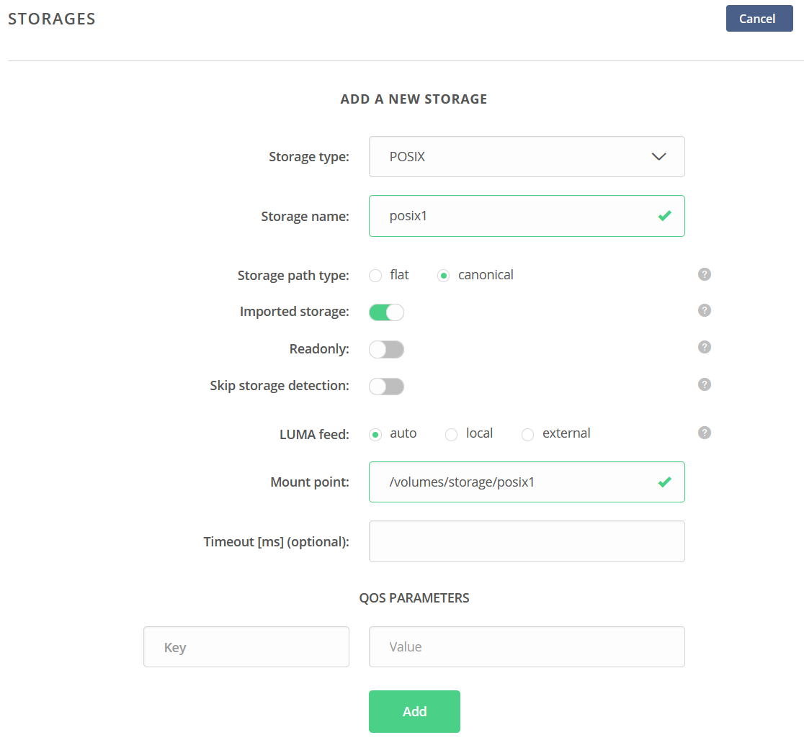

Deployment of Oneprovider
=========================
There are several possibilities how to install and deploy Oneprovider service. All options can be found in the documentation of Onedata (https://onedata.org/#/home/documentation/stable/doc/administering_onedata/oneprovider_tutorial.html). In this tutorial we describe simple deployment of Onedata service using Docker.

Requirements
------------

.. note::

   Oneprovider is a component of Onedata system. To use Onedata you have to use exisiting central component Onezone or run own on-premise (this Onezone must have an external IP address or/and a hostname).

HW and SW requirements from the official documentation are shown in following table. For testing it is sufficient to run Oneprovider on node with minimal requirements.

.. csv-table:: Requirements of Oneprovider
   :file: ../tables/oneprovider_requirements.csv
   :header-rows: 1
   :stub-columns: 1

(https://onedata.org/#/home/documentation/stable/doc/system_requirements.html)

Environment preparation for containers running
------------------------------------------
At first, it is needed to install Docker subsystem. Installation steps depend on the operating system. Installation instructions can be found in the official documentation (https://docs.docker.com/get-docker). After the installation, an actual user may need to be added to a Docker group.

.. code:: bash

   # create group docker (might not be necessary)
   sudo groupadd docker
   # add user defined in variable $USER to group docker
   sudo usermod -aG docker $USER

Environment preparation for Oneprovider
-----------------------------------
The following script was created based on the Onedata documentation. Setting up the host environment as described in the script is recommended. However, changing some predefined variables is optional as they do not impact our purposes. The script may be skipped for testing or running Oneprovider with low demands.

.. code:: bash

   ## Increase maximum number of opened files
   # In order to install Oneprovider service on one of the supported operating systems, first make sure that the maximum limit of opened files is sufficient (preferably 63536, but below /proc/sys/fs/file-max). The limit can be checked using:
   ulimit -n

   # If necessary, increase the limit using:
   sudo sh -c 'echo "* soft nofile 63536" >> /etc/security/limits.conf'
   sudo sh -c 'echo "* hard nofile 63536" >> /etc/security/limits.conf'

   # It might be also necessary to setup the limit in /etc/systemd/system.conf:
   sudo sh -c 'echo DefaultLimitNOFILE=65536 >> /etc/systemd/system.conf'
   sudo systemctl daemon-reexec

   ## Swap preference settings
   # Make sure that the swap preference (i.e. swappiness) is set to 0 (or at most 1 - see here for details):
   cat /proc/sys/vm/swappiness

   # and if necessary decrease it using:
   sudo sh -c 'echo "vm.swappiness=0" >> /etc/sysctl.d/50-swappiness.conf'

   ## Disable Transparent Huge Pages feature
   # By default, many Linux machines have the Transparent Huge Pages feature enabled, which somehwat improves performance of machines running multiple application at once (e.g. desktop operation systems), however it deteriorates the performance of most database-heavy applications, such as Oneprovider.
   # These settings can be checked using the following commands (the output shown below presents the expected settings):
   cat /sys/kernel/mm/transparent_hugepage/enabled
   always madvise [never]
   cat /sys/kernel/mm/transparent_hugepage/defrag
   always madvise [never]

   # If any of the settings is different than the above, they should be changed permanently, which can be achieved for instance by creating a simple systemd 
   # unit file /etc/systemd/system/disable-thp.service:
   [Unit]
   Description=Disable Transparent Huge Pages
   [Service]
   Type=oneshot
   ExecStart=/bin/sh -c "/bin/echo 'never' | /usr/bin/tee /sys/kernel/mm/transparent_hugepage/enabled"
   ExecStart=/bin/sh -c "/bin/echo 'never' | /usr/bin/tee /sys/kernel/mm/transparent_hugepage/defrag"
   [Install]
   WantedBy=multi-user.target
   # and enabling it on system startup using:
   sudo systemctl enable disable-thp.service
   sudo systemctl start disable-thp.service
   # Reboot system after this configuration. 
   sudo reboot

Installation of Oneprovider
-----------------------------------
Prepare the following directory structure where the Oneprovider container stores its configuration and persistent data. Of course, different names can be chosen for the base folder. This example uses folder `/opt/onedata/datahub/oneprovider`, where the folder `datahub` refers to the name of the Onezone service. The directory will contain important operational data (metadata) of Oneprovider. In order to provide continuous service, the folder has to be backed up with appropriate tools and strategies used at the site. Data loss from these folders can lead to data loss inside the Onedata system.

.. code:: bash

   # folder for configuration and persistent (meta)data of Oneprovider
   sudo mkdir -p /opt/onedata/datahub/oneprovider
   sudo mkdir /opt/onedata/datahub/oneprovider/certs
   sudo mkdir /opt/onedata/datahub/oneprovider/persistence
   # create a folder where data itself can be stored or use an existing
   sudo mkdir -p /var/onedata/storage/datahub/oneprovider

Go to the created directory.

.. code:: bash

   cd /opt/onedata/datahub/oneprovider

Download the text file with the configuration of Oneprovider container (``docker-compose.yml``).

.. code:: yaml

   version: '2.0'

   services:
      oneprovider:
         # Oneprovider Docker image version
         image: onedata/oneprovider:21.02.3
         # Hostname should be the domain name by which is the Oneprovider accesible from the Internet
         # hostname: ip-147-251-21-116.flt.cloud.muni.cz
         # Optional, in case Docker containers have no DNS access
         # dns: 8.8.8.8
         # Host network mode is preferred, but on some systems may not work (e.g. CentOS)
         # then use bridge and uncomment ports section
         # in the host mode all ports are exposed from container
         network_mode: host
         # Expose the necessary ports from Oneprovider container to the host
         # Ports section can be commented when using "network_mode: host"
         #ports:
         #  - "80:80"
         #  - "443:443"
         #  - "6665:6665"
         #  - "9443:9443"
         # Restart policy
         restart: unless-stopped
         
         # Mapping of volumes to Oneprovider container
         volumes:
            - "/var/run/docker.sock:/var/run/docker.sock"
            # Oneprovider runtime files
            - "/opt/onedata/datahub/oneprovider/persistence:/volumes/persistence"
            # Data storage directories
            - "/var/onedata/storage:/volumes/storage"
            # Additional, trusted CA certificates (all files from this directory will be added)
            - "/opt/onedata/datahub/oneprovider/cacerts:/etc/op_worker/cacerts"

Open the file in a text editor. Changing the value of `image:` changes a desired version of Oneprovider. More information about the latest version is available in the Oneprovider image on the Docker Hub (https://hub.docker.com/r/onedata/oneprovider/tags).

.. note::

    Please remember that the version of the Oneprovider must be at least as high as the version of the used Onezone. For detailed information about the compatibility constraints, see https://onedata.org/#/home/versions.

The location of the folders can be changed by editing the paths in the `volumes:` section. The domain name of the new Oneprovider must be filled out before the first Oneprovider run.

The Oneprovider should be accessible with this name from the Internet and the local host.  Check the hostname of the physical node using

.. code:: bash

   hostname -f

and fill it in to the `hostname:` value.

.. code:: yaml

   hostname: example.domain.eu

It is crucial to discover machine's actual domain name. If the machine is behind a NAT, the hostname command can return incorrect output. In this case, the following line should be added to ``/etc/hosts`` file. The line ensures that the selected domain address will be resolved to the local node.

.. code::

   127.0.0.1 example.domain.eu

Download the Oneprovider Docker image from Docker Hub, it can take several minutes.

.. code:: bash

   docker compose pull

Running the container

.. warning::

   The following command opens a web server on a node where the container runs and then listens on port 9433. It is important to block access to this port by someone else.

.. code:: bash

   docker compose up -d --no-recreate

In the docker compose file, the restart policy is specified to run the container ``unless-stopped``. Due to this policy, the container will also run after the host reboot (only if the docker daemon runs automatically after reboot – this is a default behaviour).

How to print live output of the Oneprovider can be found `here <#monitor-of-oneprovider-container>`_.

The first start-up of the container can last for a few minutes. The process is finished after the log message
Cluster initialized successfully

Configuration of Oneprovider
-----------------------------------
The setup of the Oneprovider is done in the following steps.
Access the URL https://example.domain.eu:9443 using a web browser. The first part of the Onepanel installation is performed through the browser with a self-signed certificate. The browser alerts about this; however, it is expected. During this process, a valid Let’s Encrypt certificate is generated, and it will be used for further communication. There is also a possibility to use own certificate.

.. image:: ../images/02_OP_setup.png
   :width: 500
   :align: center
   :alt: Beginning of Oneprovider setup

Choose ``Create a new cluster`` and fill in an emergency passphrase. Save the passphrase to a safe place. It can be used in the situation when access to the Oneprovider through the external identity provider is lost.

.. image:: ../images/04_OP_passphraze.png
   :width: 500
   :align: center
   :alt: Setup of passphraze

On the following screen, click the ``Create Oneprovider cluster`` button.

.. image:: ../images/03_OP_setup.png
   :width: 500
   :align: center
   :alt: Oneprovider welcome page

Because a new cluster is being installed, select the first four possibilities (Database, Cluster Worker, Cluster Manager, Primary Cluster Manager). On the contrary, leave the Ceph option unchecked. After this, click the ``Deploy`` button.

.. image:: ../images/05_OP_cluster_setup.png
   :width: 500
   :align: center
   :alt: Cluster setup

It takes some time. Afer the cluster is deployed, the web interface prompts for a registration token:

.. image:: ../images/06_OP_registration.png
   :width: 500
   :align: center
   :alt: Registration Oneprovider to Onezone

Now, the newly deployed Oneprovider must be registered within the Onezone service. In this manual, we use a well-established Onezone instance ``EGI DATAHUB`` located at https://datahub.egi.eu. The registration process is described in the browser or below.

In a new browser window or panel, open https://datahub.egi.eu, then sign in with the EGI identity through EGI Check-in (blue icon). The identity can be chosen from various identity providers; the identity from the home institution, if on the list, is recommended. Also, a social identity such as Google, Facebook, GitHub and others is possible.

.. image:: ../images/07__OZ_sign_in.png
   :width: 500
   :align: center
   :alt: Onezone sign in page

After a successful login, the Onezone web interface pops up. Now, a newly created cluster is added to a user account.  To do this, go to:

.. centered::
   CLUSTERS > Plus sign (Adding a new cluster)

.. image:: ../images/08_OZ_clusters.png
   :width: 500
   :align: center
   :alt: Cluster management in Onezone

Copy a token from the Onezone web interface to the Oneprovider.

.. image:: ../images/09_OP_registration.png
   :width: 500
   :align: center
   :alt: 

Fill in the basic information about the Oneprovider. Provider name is public information; users will see it, e.g. in the web interface. The selected subdomain will be used, e.g., by users in the parameters for the Oneclient.

.. image:: ../images/10_OP_registration.png
   :width: 500
   :align: center
   :alt: Registering Oneprovider

Check the IP address of Oneprovider. The prefilled value should be the correct value.

.. image:: ../images/11_IP_address.png
   :width: 500
   :align: center
   :alt: Cluster IP address

After a DNS check (it may take a while), the Let’s Encrypt certificate can be requested. If needed, the Oneprovider can also use the certificate from a different authority.

.. image:: ../images/12_certificate.png
   :width: 500
   :align: center
   :alt: Setup certificate

Now, the Oneprovider is set up.

Adding the storages
-----------------------------------
After the successful registration and configuration of the Oneprovider, it is necessary to add the storage for storing the data.

This example shows how to add a new POSIX storage. The storage creation is triggered after the first Oneprovider configuration. However, these storages can be later added and removed in the Oneprovider web interface. It is important for a mount point not to end with a slash.

Monitoring Oneprovider container
-----------------------------------
You can see the live log of the Oneprovider:

.. code:: bash

   docker compose -f docker-compose.yml logs --follow --timestamps

The system resources used by the Oneprovider and other containers can be monitored using

.. code:: bash

   docker stats

Updating Oneprovider to a newer version
-----------------------------------
It is strongly recommended to keep the Oneprovider up to date. Docker Hub allows checking the availability of a new version of the Oneprovider image. The condition for installing a new version of Oneprovider is that the Onezone has to be at least the same version as the Oneprovider. The Onezone version can be checked in the bottom left corner of its web interface. If the version of Onezone is lower than the desired new version of Oneprovider, the Onezone needs to be updated first.
To update the Oneprovider, edit the version number in ``docker-compose.yml``:

.. code:: 

   # Oneprovider Docker image version
   image: onedata/oneprovider:20.02.13

Then download the new image using

.. code:: bash

   docker-compose -f docker-compose.yml pull

Remember that during the update process, the Oneprovider is unavailable to accept user requests. The update can be performed using

.. code:: bash

   docker-compose -f docker-compose.yml up -d --no-recreate

After the update, check if all services are running correctly.
