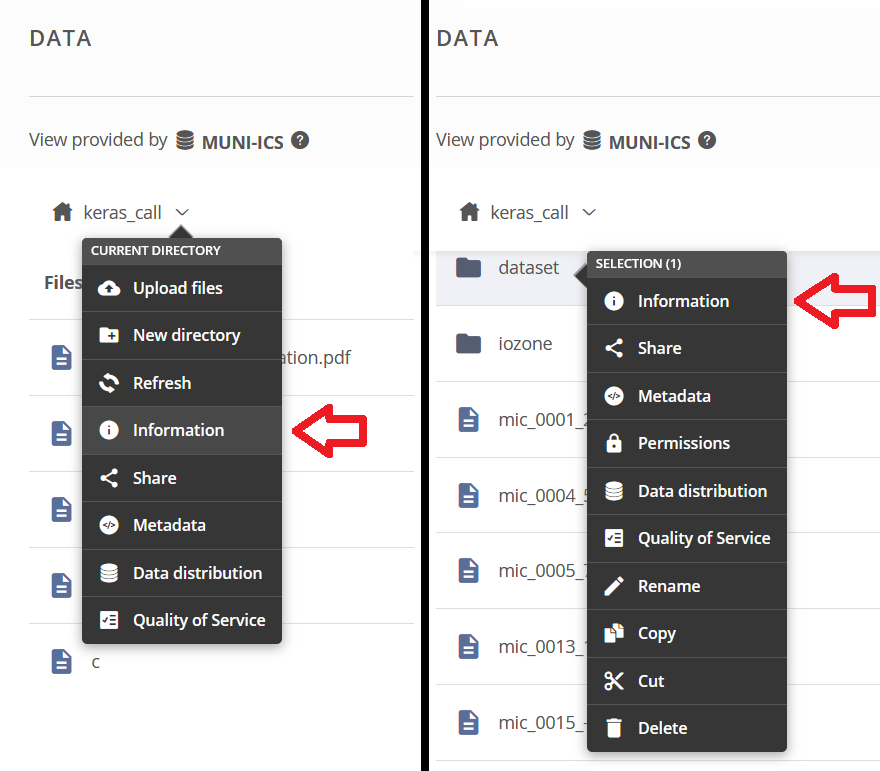
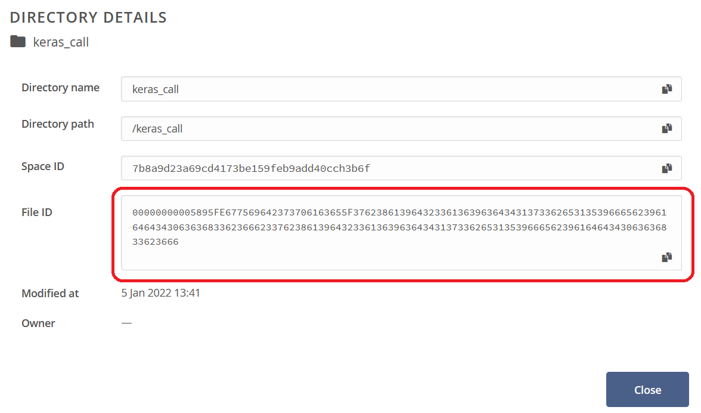

Batch dataset download
======================
There is a simple posibility to download whole dataset at once from command line interface (CLI) with pripared one-file Python script. For using this script for download the required data tha data has to be shared - a URL accessible without login should exists. Example of such URL: ``https://datahub.egi.eu/share/c01c27c2e9ea750f948aeb75a40a37a2ch6dbc``. 

.. warning::

   Only spaces which are shared can be downloaded by this script. 

Every shared object (space, directory or file) have its own unique identifier (``File ID``). If you know the file ID you can download the object. 

How to get file identifier
--------------------------
When you access the URL by your web browser, you can found ``File ID`` by right click on the name of a space/directory/file in pop-up menu item ``Information``.

File ID is a long string as you can see bellow.

.. warning::

   ``File ID`` which you can see when you are log in Onedata system is different from ``File ID`` mentioned above.

Usage of the script
-------------------
Prepare environment
*******************
To run this script you need ``Python 3`` installed with module ``requests``. For installing ``Python 3`` please visit https://www.python.org/downloads/. Module ``requests`` can be installed by command:

.. code:: bash

   pip3 install -U requests

The script itself can be downloaded from public repository https://raw.githubusercontent.com/CERIT-SC/onedata-downloader/master/download.py. You can do it e.g. with ``curl``:

.. code:: bash

   curl -s --output download.py https://raw.githubusercontent.com/CERIT-SC/onedata-downloader/master/download.py

Download data
*************
If you have pripared environment, you can download the data. Run the script in following way and replace argument ``FILE_ID`` with the identifier of desired object.

.. code:: bash

   python3 download.py FILE_ID

Script download whole object with given ``File ID`` to the recent directory. The script print information about progress of download or possible errors. Run the script with argument ``-h`` for print help:

.. code:: bash

   python3 download.py -h

Advance tips
************
You can make the file with script executable and run it directly by its name:

.. code:: bash

   # change file permission
   chmod u+x download.py

   # now you can run the script in this way
   ./download.py FILE_ID

The script can be used directly from its repository without need to download it. 

.. code:: bash

   curl -s https://raw.githubusercontent.com/CERIT-SC/onedata-downloader/master/download.py | python3 - FILE_ID
