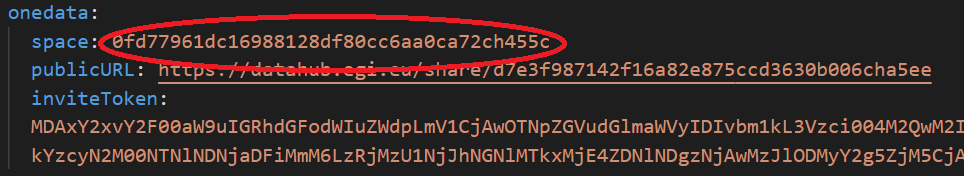
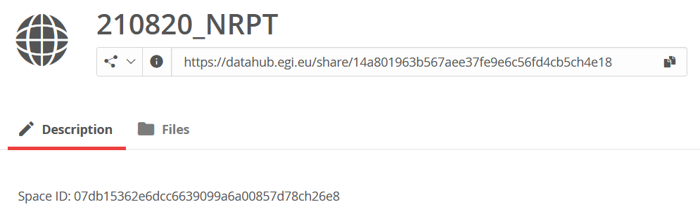
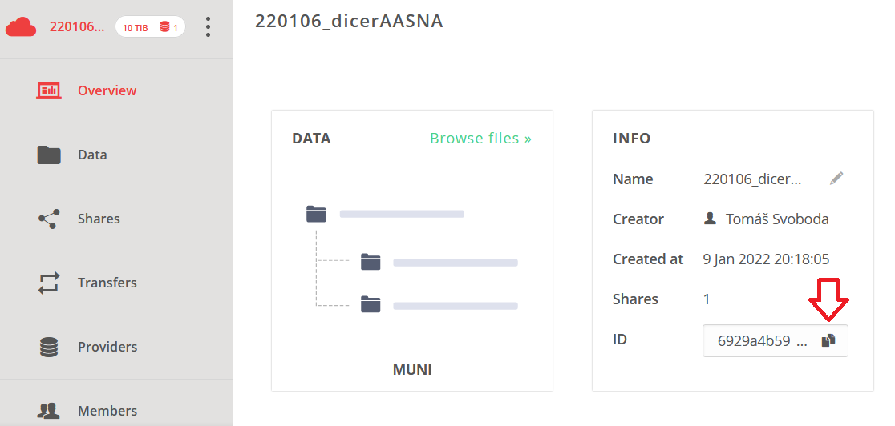

Download a space
================
There is posibility to download whole content of a space. This steps can be used also on a directory, if you would like to download it recursively. At first you should have a unique identifier of the space or directory. 

Get space identifier
--------------------
Space ID you can find in several places. 

Metadata file
*************
Space ID is contained in YAML file with space metadata. 

Web page of a Share
*******************
After openning share URL in your web broser, you can find Space ID on ``Description`` tab. 

Overview of a space
*******************
If you have access to the space through the Onedata GUI, you can copy it from space Overview.

Get file identifier
-------------------
File ID can by found by left click on the name of space or by right click on the name of directory/file in menu item ``Information``.

.. image:: ../images/22_file_information.png
   :width: 500
   :align: center
   :alt: Information about file or directory

File ID is long string as you se bellow.

.. image:: ../images/21_file_id.png
   :width: 500
   :align: center
   :alt: File ID

Usage of the script
----------------------------
Basic usage
***********
The script can be downloaded from URL https://raw.githubusercontent.com/CERIT-SC/onedata-downloader/master/download.py e.g. by this command

.. code:: bash

    curl -s --output download.py https://raw.githubusercontent.com/CERIT-SC/onedata-downloader/master/download.py

With identifier of the space or directory, you can download the data. 

.. note::

    Despite Space ID and File ID are two different identifier of a space, you can use any of them. 

Replace FILE_ID with the acquired identifier.

.. code:: bash

    ./download.py FILE_ID

Script download whole file structure to recent directory. 

Direct usage
************
The script can be used without downloading

.. code:: bash

    curl -s https://raw.githubusercontent.com/CERIT-SC/onedata-downloader/master/download.py | python3 - FILE_ID
