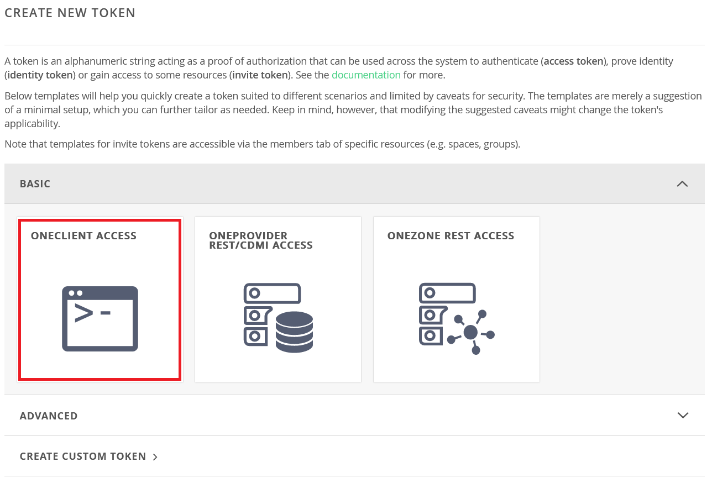
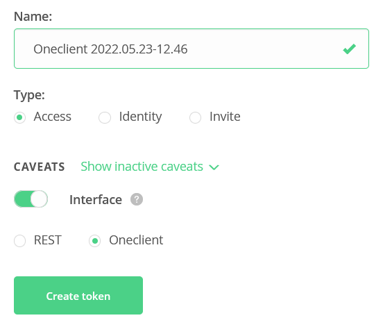
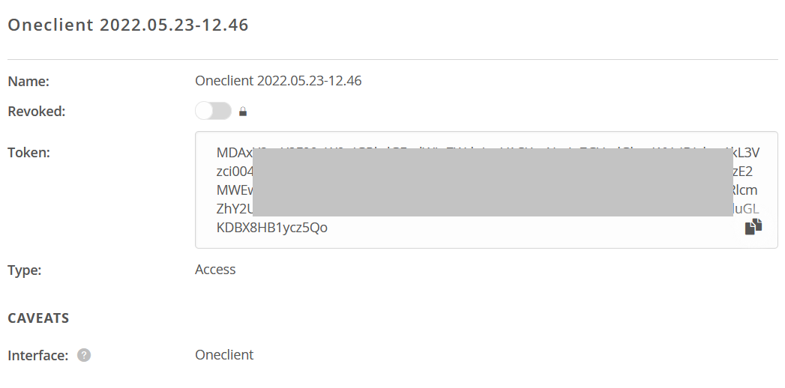

Mount on a local computer
=========================

Onedata provides command-line application Oneclient to access stored data mounted on local computer. Your spaces are mounted as directories in specified path. You can work with the date within this folder in a normal POSIX way (you can use commands like ls, cp, …). 

Oneclient can be install on Linux by following command. It can be run on several Linux distro (Ubuntu, Fedora, Debian, CentOS). 

Get an access token
-------------------
You can get the access token through the Onedata web interface. Go to the page https://datahub.egi.eu/ozw/onezone/i#/onedata/tokens/new and choose token type by click on the ``Oneclient access``. 

You can let token parameters in default set up. 

A new access token will be generated. You can copy&paste it. 

Run the Oneclient application
-----------------------------
Download and install Oneclient by following command

.. code:: bash

   curl -sS http://get.onedata.org/oneclient.sh | bash

Run the application by these steps:

.. code:: bash

   # create folder where Onedata spaces will be mounted
   mkdir onedata

   # mount Onedata spaces
   oneclient -t <ACCESS_TOKEN> -H <PROVIDER_IP> <MOUNT_PATH>

Further reading about Oneclient: https://onedata.org/#/home/documentation/stable/doc/using_onedata/oneclient.html

.. todo::

   specific instructions how to obtain the token, and provider IP/name
